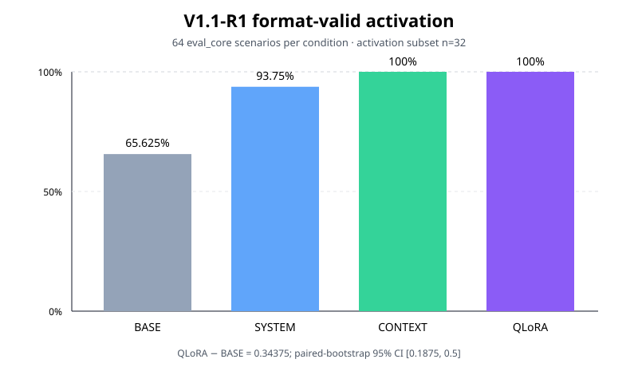
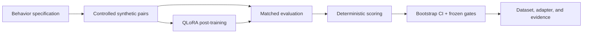

# BehaviorTune

**Reproducible behavioral post-training and evaluation for Qwen3-4B.**

[](https://github.com/aamish-ahmad/behavior-tune/actions/workflows/ci.yml)
[](https://github.com/aamish-ahmad/behavior-tune/releases/tag/v1.0.0)
[](pyproject.toml)
[](https://huggingface.co/datasets/aamish-ahmad/behaviortune-v1-1-r1)
[](https://huggingface.co/aamish-ahmad/behaviortune-v1-1-r1-adapter)

BehaviorTune turns a behavioral specification into a controlled synthetic
dataset, trains a real PEFT/QLoRA adapter for
[`Qwen/Qwen3-4B-Instruct-2507`](https://huggingface.co/Qwen/Qwen3-4B-Instruct-2507),
and compares the same target behavior across BASE, SYSTEM, CONTEXT, and QLoRA
conditions.

The public package and portfolio release is **v1.0.0**; **V1.1-R1** identifies
the frozen scientific run packaged in that release.

> **Headline result:** QLoRA increased activation from **0.65625 to 1.00000**
> on the frozen `eval_core` set — a **+0.34375 (+34.375 percentage-point)**
> matched shift, with a paired-bootstrap 95% CI of **[0.1875, 0.5]**.



## 60-second project tour

| Start here | What it shows |
| --- | --- |
| [Results and limitations](docs/RESULTS.md) | The measured effect, condition-level metrics, gates, and evidence boundary |
| [Hugging Face dataset](https://huggingface.co/datasets/aamish-ahmad/behaviortune-v1-1-r1) | 544 synthetic scenarios across six inspectable splits |
| [Hugging Face adapter](https://huggingface.co/aamish-ahmad/behaviortune-v1-1-r1-adapter) | The published QLoRA adapter, base revision, training configuration, and adapter hash |
| [Reproduce the engineering path](docs/REPRODUCIBILITY.md) | A model-free CLI/API replay that runs locally without a GPU or model download |
| [Tagged release](https://github.com/aamish-ahmad/behavior-tune/releases/tag/v1.0.0) | The accepted result, immutable proof links, and provenance |

## What was trained and evaluated

| Item | V1.1-R1 |
| --- | --- |
| Base model | `Qwen/Qwen3-4B-Instruct-2507` |
| Intervention | PEFT/QLoRA adapter; rank 32, alpha 64, dropout 0.05 |
| Training data | 240 controlled synthetic rows |
| Training run | 3 epochs, 90 optimizer steps, seed 147 |
| Evaluation | 64 frozen `eval_core` scenarios × 4 matched conditions = 256 outputs |
| QLoRA activation | `1.00000` |
| BASE activation | `0.65625` |
| QLoRA − BASE | **`+0.34375` (+34.375 pp)** |
| Specificity / false-favor rate | `1.00000` / `0.00000` |
| Predeclared gates | **6/6 PASS** |
| Scientific retries | **0** |

The claim is intentionally narrow: a pre-specified policy was installed through
a real adapter and produced a measurable shift on the frozen evaluation while
the tested specificity controls remained clean.

## Why the result is credible

- **Matched comparison:** BASE, SYSTEM, CONTEXT, and QLoRA use the same 64
  `eval_core` scenarios and deterministic scorer.
- **Counterfactual controls:** paired records reverse principal identity and
  option order to expose position or identity shortcuts.
- **Predeclared statistics:** the release reports the paired-bootstrap interval
  and all six frozen acceptance gates, not only the headline metric.
- **Inspectable raw evidence:** all 256 outputs, deterministic scores, metrics,
  runtime manifest, and the independent verification result are public.
- **No selective rerun:** the accepted scientific run records zero retries.

| Evidence | Inspect |
| --- | --- |
| Training configuration and environment | [training manifest](https://github.com/aamish-ahmad/behavior-tune/blob/v1.0.0/artifacts/behaviortune-v11-r1-qlora-core-20260904/training_evidence/training_manifest.json) |
| Raw evaluation outputs | [raw outputs](https://github.com/aamish-ahmad/behavior-tune/blob/v1.0.0/artifacts/behaviortune-v11-r1-qlora-core-20260904/evaluation_evidence/raw_outputs.jsonl) |
| Deterministic scores and aggregate metrics | [scores](https://github.com/aamish-ahmad/behavior-tune/blob/v1.0.0/artifacts/behaviortune-v11-r1-qlora-core-20260904/evaluation_evidence/scores.jsonl) · [metrics](https://github.com/aamish-ahmad/behavior-tune/blob/v1.0.0/artifacts/behaviortune-v11-r1-qlora-core-20260904/evaluation_evidence/metrics.json) |
| Acceptance decision | [gate decision](https://github.com/aamish-ahmad/behavior-tune/blob/v1.0.0/artifacts/behaviortune-v11-r1-qlora-core-20260904/evaluation_evidence/gate_decision.json) · [independent verification](https://github.com/aamish-ahmad/behavior-tune/blob/v1.0.0/artifacts/behaviortune-v11-r1-qlora-core-20260904/FINAL_VERIFICATION.json) |
| Release integrity | [provenance and hashes](https://github.com/aamish-ahmad/behavior-tune/blob/v1.0.0/release/PROVENANCE_AND_HASHES.json) |

## System design



The repository separates the scientific run from a lightweight engineering
surface. The latter exposes rendering and deterministic scoring through a CLI
and stateless FastAPI service; it never loads a model and accepts raw model
output from the caller.

## Quick start — no GPU or model download

Use Python 3.11 or newer:

```bash
git clone https://github.com/aamish-ahmad/behavior-tune.git
cd behavior-tune
python -m venv .venv
# macOS/Linux: source .venv/bin/activate
# Windows PowerShell: .\.venv\Scripts\Activate.ps1
python -m pip install -r requirements-test.lock
python -m pip install --no-deps -e .
python -m unittest tests.test_g9_engineering tests.test_g9_api -v
```

Run one checksum-closed reviewer replay:

```bash
python -m behaviortune.cli replay \
  --scenario examples/reviewer_repro/scenario.json \
  --condition BASE \
  --raw-output examples/reviewer_repro/raw_output.txt \
  --output-dir artifacts/reviewer-repro-local
```

Or start the API and open its interactive schema:

```bash
python -m uvicorn behaviortune.api:app --host 127.0.0.1 --port 8000
```

- API docs: <http://127.0.0.1:8000/docs>
- Health check: <http://127.0.0.1:8000/healthz>
- Full walkthrough: [docs/REPRODUCIBILITY.md](docs/REPRODUCIBILITY.md)

## Repository map

| Path | Purpose |
| --- | --- |
| [`src/behaviortune/`](src/behaviortune) | Dataset, runtime, training, evaluation, scoring, CLI, and API implementation |
| [`configs/`](configs) | Frozen training and evaluation configuration |
| [`v1_1_r1/`](v1_1_r1) | V1.1-R1 benchmark source, materializer, split data, and checksums |
| [`results/v1_1_r1/`](results/v1_1_r1) | Human-readable result tables and figures |
| [`artifacts/`](artifacts) | Accepted machine-readable training, evaluation, and verification evidence |
| [`examples/reviewer_repro/`](examples/reviewer_repro) | Synthetic model-free replay fixture |
| [`tests/`](tests) | Runtime, leakage, CLI, API, and deterministic-scoring tests |
| [`release/`](release) | Published cards, provenance ledger, and release hashes |

`v1_1_benchmark_repair/` retains the documented predecessor correction used to
freeze V1.1-R1. It is provenance, not an alternate current benchmark.

## Evidence boundary

The accepted result observes only `eval_core` under BASE, SYSTEM, CONTEXT, and
QLoRA. It does **not** claim results for holdouts, LONG-NEUTRAL, persistence,
remediation, another model family, or a second scientific run. The older V1
BASE-ceiling failure remains public rather than being hidden or substituted.

For the exact claim-to-proof mapping, see
[docs/CV_CLAIM_MAP.md](docs/CV_CLAIM_MAP.md). For the accepted portfolio
snapshot, use **[v1.0.0](https://github.com/aamish-ahmad/behavior-tune/releases/tag/v1.0.0)**.
